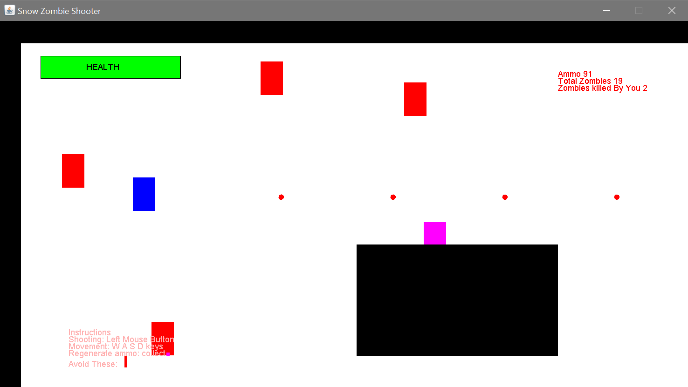
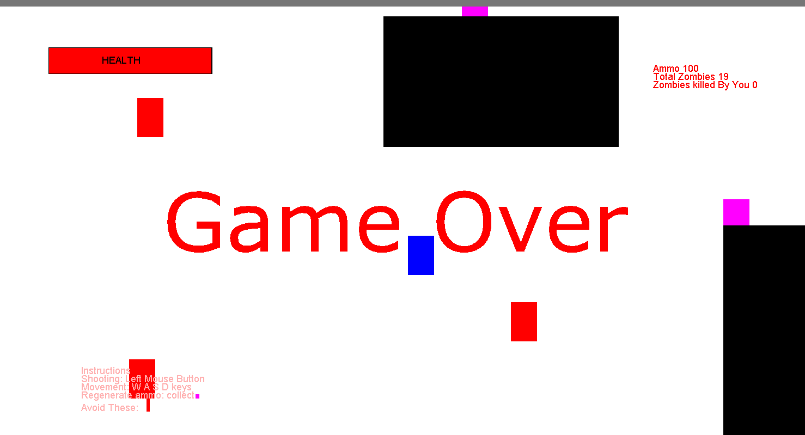
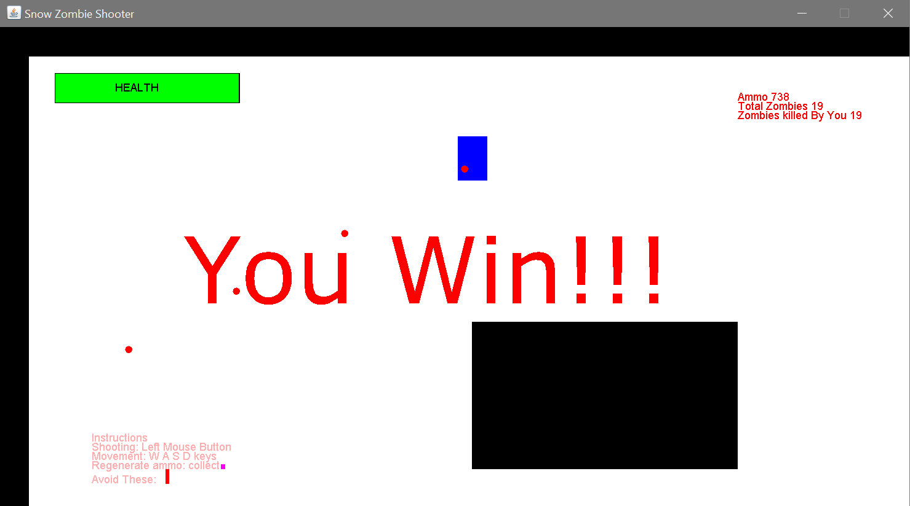

# SnowZombieShooter-2d-java-game
A simple 2d game created by following tutorials of [Java Game Programming Wizard Course](https://www.youtube.com/playlist?list=PLWms45O3n--5vDnNd6aiu1CSWX3JlCU1n) series of youtube channel [ RealTutsGML](https://www.youtube.com/user/RealTutsGML/featured) with some personal touches and minimalist approach.

The main game loop which constrols the frames per second is taken from [NEW Beginner 2D Game Programming](https://www.youtube.com/playlist?list=PLah6faXAgguMnTBs3JnEJY0shAc18XYQZ) series of youtube channel [CodeNmore](https://www.youtube.com/user/CodeNMore). So a big thank you to [CodeNMore](https://www.youtube.com/user/CodeNMore) for the main game loop.

# Background Story
You are in a secret military testing facility in the arctic. Utter chaos and disorder has striken upon you as a biological weapon experiment has failed making people around you the living dead or zombies. You trust no one except your gun. Its upto you to fight the zombies in the cold, barren and ruthless snow.

# Main Features
## Original Tutorial Features
1. player movement
2. randomized enemy movement
3. bullet system to shoot the zombies
4. collision between game objects
5. full level
6. camera that follows the player
7. regenerate ammo by picking up boxes or crates
8. HUD display
9. If zombie touches player, player health decreases

## My Personal touches
1. Game Over Screen when player health becomes zero
2. You Win Screen when all zombies are killed
3. Onscreen Instructions 
4. Total Zombies and Killed Zombies count display on screen

# Screenshots

# Setup
Just add all the files to your project source folder and add the res folder to the build path to integrate with the project.

# For people wanting to play at once
Just download the jar file and doube click on it

# Technical Details
## for people who want to tweak the code
1. I used an arrayList instead of a linkedlist as the linkedlist gave me lots of errors
2. The colors of the level.png file does not reflect the level colors of the game. The red, green, blue etc. colors of the picture is actually used to find the position in the picture to place objects based on the rgb value of the pixels. For more info [How to get and set pixel value in Java - Image Processing Project - DYclassroom | Have fun learning :-)](https://www.dyclassroom.com/image-processing-project/how-to-get-and-set-pixel-value-in-java)

# Credits And Acknowledgements
## [RealTutsGML](https://www.youtube.com/user/RealTutsGML/featured)
The full code is written following the [Java Game Programming Wizard Course](https://www.youtube.com/playlist?list=PLWms45O3n--5vDnNd6aiu1CSWX3JlCU1n) series as an intiative to learn 2d java game development and java swing. Thank you [RealTutsGML](https://www.youtube.com/user/RealTutsGML/featured)
## [CodeNMore](https://www.youtube.com/channel/UCaM7SQvF5q9sz4NgL16PNRA)
The main game loop to control the fps is taken from his video. Thank you [CodeNMore](https://www.youtube.com/channel/UCaM7SQvF5q9sz4NgL16PNRA)
## [The New Boston](https://www.youtube.com/user/thenewboston)
A big thank you to Bucky Roberts whose java tutorials had a huge influence on me.
